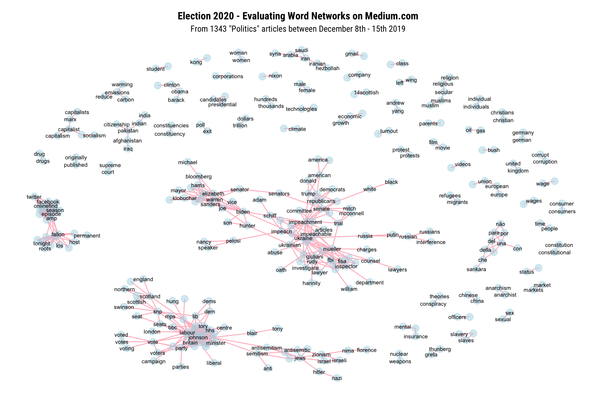
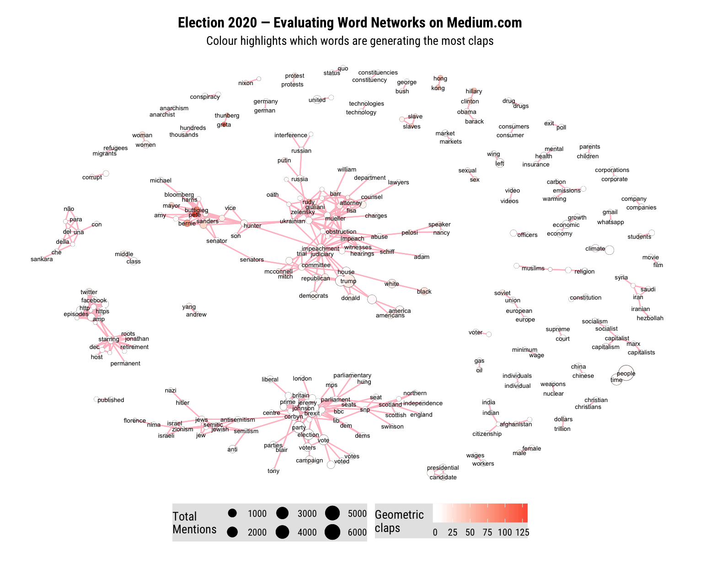

# Visualizing political discourse every week

I'm looking to create node networks and LDA models to visualize weekly topics from [Medium Politics](https://medium.com/topic/politics) articles.

[]()

[]()

I scrape a week's worth of Medium articles — ~1,000 articles, 400,000 words — then post these graphs to [r/uspolitics](https://www.reddit.com/r/uspolitics/)

# Packages
For node networks:
```
library(tidyverse)
library(ggraph)
library(igraph)
library(widyr)
library(tidytext)
library(ggrepel)
library(extrafont)
```

For LDA models (soon):
```
library(tidyverse)
library(topicmodels)
library(tidytext)
library(LDAvis)
```
